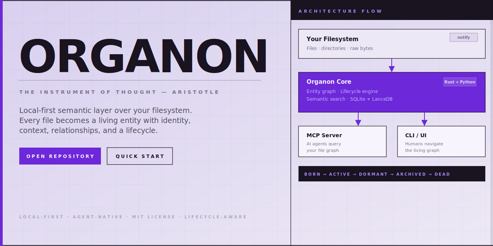

# Organon

[](https://github.com/andrii-su/organon/actions/workflows/ci.yml)
[](https://github.com/andrii-su/organon/actions/workflows/pages.yml)
[](./crates/)
[](./ai/)
[](./LICENSE)



**Organon** is a local-first semantic layer over your filesystem. Every file becomes a living entity — with identity, context, relationships, and a lifecycle. Built for humans and AI agents alike.

## 🧠 Why Organon

Files are not static blobs. They're created with intent, evolve over time, relate to other files, and eventually become irrelevant. No existing tool treats them this way.

- ✅ **Entity graph** — each file gets a stable identity, purpose, tags, and a relationship graph
- ✅ **Lifecycle engine** — `born → active → dormant → archived → dead`, driven by real events
- ✅ **Semantic search** — find files by meaning, not just name; vector + FTS + hybrid modes
- ✅ **MCP server** — Claude, Cursor, and any MCP-compatible agent can query your file graph
- ✅ **100% local** — SQLite + LanceDB, nothing leaves your machine

## 🌐 Docs

- Live: [andrii-su.github.io/organon](https://andrii-su.github.io/organon/)
- Source: [`docs/`](docs/)

## 🚀 Quick Start

### 1. Bootstrap

```bash
bash setup.sh
```

Requires Rust (stable), Python 3.12+, and `uv`.

### 2. Watch a directory

```bash
organon watch .
```

### 3. Search semantically

```bash
organon search "authentication logic" --mode hybrid
organon search "database schema" --state active --ext rs
```

### 4. Explore relationships

```bash
organon graph src/main.rs --depth 2 --format mermaid
```

### 5. Run the desktop UI

```bash
cd apps/desktop
npm install
npm run tauri dev
```

The Tauri shell talks to the existing local REST API and auto-starts the same
server in-process when no API is already running.

## 🔄 Lifecycle

Every entity moves through a deterministic state machine:

```text
born → active → dormant → archived → dead
```

Transitions are driven by filesystem events, git activity, access patterns, and explicit commands. Organon surfaces what matters now and archives what doesn't.

## 🖥️ CLI Reference

```bash
# Watch roots for filesystem changes
organon watch .

# Metadata filters
organon find --state active --ext rs
organon find --modified-after 2026-01-01 --larger-than-mb 10

# Search: vector · FTS · hybrid
organon search "watcher" --state active --mode hybrid
organon search "sqlite graph" --modified-after 2026-01-01

# Graph output — text, DOT, Mermaid
organon graph path/to/file.rs --depth 2 --format text
organon graph path/to/file.rs --format dot
organon graph path/to/file.rs --format mermaid

# Diff filesystem vs DB, export, summarize
organon diff .
organon export --format json
organon export --format csv --output entities.csv
organon summarize path/to/file.rs --model llama3.2
```

Global flags: `--quiet` · `-v` (info) · `-vv` (debug)

## 🏗️ Architecture

```text
crates/
  organon-core/   Rust: filesystem watcher, entity graph (SQLite), lifecycle engine
  organon-mcp/    Rust: MCP server exposing the graph to AI agents
  organon-cli/    Rust: CLI for querying and managing entities
apps/
  desktop/        Tauri + React shell over the existing REST API
ai/
  extractor/      Python: content extraction (text, PDF, code, images)
  embeddings/     Python: local semantic vectors via fastembed + lancedb
  mcp_server/     Python: MCP tools (search, query, relate)
```

## 📦 Stack

| Layer | Technology |
| ----- | ---------- |
| Core daemon | Rust — `notify` · `tokio` · `rusqlite` · `tantivy` |
| Semantic vectors | Python — `fastembed` · `lancedb` |
| Content extraction | Python — text · PDF · code · images |
| Local LLM | `ollama` — summaries via any local model |
| Agent protocol | MCP (Model Context Protocol) |
| Storage | SQLite + LanceDB — 100% on-disk |
| Desktop UI | Tauri + React — practical shell over the existing API |

## 🧪 Development

```bash
# Rust tests
cargo test --workspace --all-targets

# Python linting
uv run --group dev ruff check ai

# Python tests
uv run --group dev pytest
```

### Desktop UI

```bash
cd apps/desktop

# install frontend + tauri dependencies
npm install

# dev mode
npm run tauri dev

# frontend tests
npm test

# production app build
npm run tauri build
```

The desktop app currently ships `Search`, `Graph`, `History`, `Impact`, and
`Duplicates` screens plus a shared entity detail panel.

## 🛣️ Roadmap

- [ ] `organon-core`: filesystem watcher + SQLite entity graph
- [ ] `organon-core`: lifecycle state machine
- [ ] `ai/extractor`: content extraction (text, PDF, code)
- [ ] `ai/embeddings`: local semantic vectors with fastembed
- [ ] `organon-mcp`: MCP server (search, query, relate)
- [ ] `organon-cli`: CLI for power users
- [ ] Dogfood: integrate with OpenClaw/Nova
- [ ] macOS menu bar app (Tauri)

## 🔒 Principles

- **Local-first.** Nothing leaves your machine without explicit permission.
- **Open.** MIT license. No telemetry. No accounts.
- **Agent-native.** MCP server from day one.
- **Lifecycle-aware.** Files are organisms, not static objects.

## License

MIT
